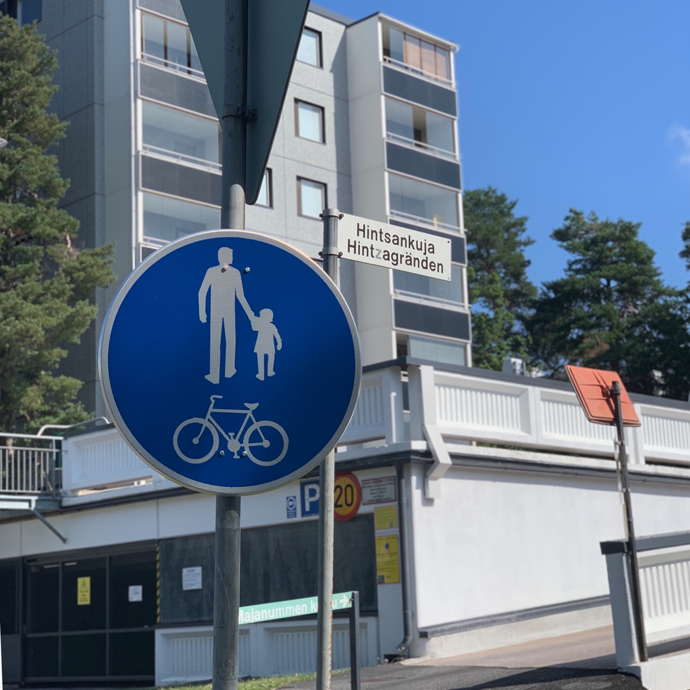
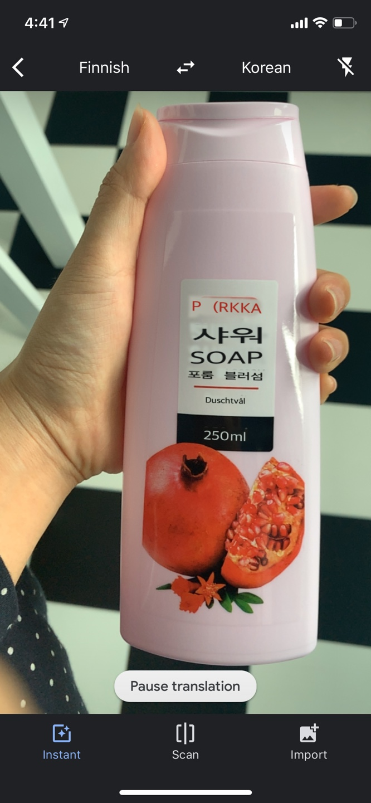

## 👀 알을 깨러 가는 길

절대 안 끝날 것 같은 계절학기가 드디어 끝났다. 두달 전부터 매일 핀에어 앱을 들락날락 했는데, 드디어 한국을 떠난다. 패키지 관광을 빼고 제대로 여행을 해본 게 거의 5년 전이라 많이 떨렸다. 

한국에서 나는 (대학에 들어와서까지도) 이유 모를 불안함에 울면서 잠들곤 했다. 눈을 감으려고 하면 10분이라도 생산적인 뭔가를 더 하고 자야 한다는 압박감이 심했다. 학교에서 상담을 받아보기도 했는데, 16회기를 다 채우질 못하고 기껏해야 한두번 나가고 학기가 종료되면서 큰 도움을 받진 못했다.

여튼, 교환학생 생활의 목표가 무엇이냐는 질문을 종종 받는데, 내 목표는 '<u>덜 불안해하기</u>'다. (이렇게 이야기하기 민망해서 사실 '놀려구요!' 라고 말한다). 변명처럼 들릴 수 있겠지만 그래서 비자 발급이나 집 구하기처럼 가장 기본적인 것들을 빼고는 아무런 계획을 세우지 않았다. 

## 🐻 일정 없이 살기

핀란드의 여름은 밤 열시가 되어야 어둑어둑해지고, 열시 반쯤 되어야 그제서야 밤같다. 그래서 처음 며칠은 어둑어둑한 모습을 보질 못하고 잠들었다. 그 덕인지 한국에서 알람을 몇개씩 맞춰도 절대 못하던 아침형 인간의 삶을 살고 있다. 밤 10시~11시쯤 잠들어서 아침 6시쯤에 눈을 뜬다. 

아침에 일찍 눈이 떠지니 아침밥을 먹을 수밖에 없고, 점심까지 대여섯시간이 비는데 집에는 아무도 없어서 어디라도 나가게 된다. 보통의 나라면 그 시간이 아까워서 구글맵과 함께 빽빽한 여행 일정을 세웠겠지만, 데이터가 터지지 않는 사실상 공기계가 되어버린 아이폰이라면 멀리 나가질 못하게 된다. (투르쿠 대부분의 시내버스는 정류장을 표시해주질 않기 때문에 항상 모바일 웹으로 버스의 현재 위치를 확인해야 한다)

그래서 머리가 기억할 수 있는 한 최대한 멀리 다녀온다. 그제는 버스 정류장 앞까지, 어제는 가까운 슈퍼마켓까지, 오늘은 슈퍼마켓 건너에 있는 숲까지! 과장 조금 보태면 테세우스가 실타래로 미궁을 빠져나오는 기분이 이랬을까?

 ## 📌 시각 정보에서 자유로워지기

핀란드어를 하나도 모르는 사람에게 핀란드의 거리는 그림같다. 한국의 거리에는 정보가 너무 많다. 형형색색 광고에, 표지판에, 심지어 시끄러운 유투브 광고까지 그야말로 쉴 틈이 없다.

불행인지 다행인지 여기에는 읽을 수 있는 글자가 몇 없다. 중국어나 일본어는 가끔 아는 한자로, 스페인어는 영어랑 비슷하게 생긴 철자를 보고 아주 대충의 내용은 알아들을 수 있겠는데 여기는 정말 전혀! 아무것도 추리할 수 없다. (지금까지 할 수 있는 말 : Hei! Moi! Kiitos! Hyvää!)

유투브 광고도 그렇다. 당장 떠오르는 광고만 해도 '하또하또', '야나두', '야놀자' (...) 처럼 화려한 광고가 대부분이었는데 이곳 광고는 정말 조용하다. 동영상을 틀어놓고 잠시 딴짓을 하고 있으면 광고 중인지 헷갈릴 정도다. 아마 내가 핀란드어를 전혀 못하니까 더 광고같지 않게 느낄 수도 있겠다.

물론 장을 볼 땐 항상 구글 번역기를 켜고 다닌다. 영어로 의사소통은 너무 잘 되지만 정작 영어로 써놓은 건 별로 없는 알쏭달쏭 핀란드

## 🙋 핀란드는 원래 이래?

길거리에 광고가 너무 없다며, 하다못해 길거리에 연예인이 하는 광고도 없는 것 같다고 튜터에게 물었다. 오히려 튜터는 광고를 비롯한 시각적인 자극이 가득한 서울이 흥미롭다고 했다. 한국에서는 광고의 개수가 흔히 연예인의 성공 지표처럼 여겨지는데, 이곳은 오히려 더 일반인에 가까운 사람들이 광고에 나온다고 한다. 그리고 유명 연예인이 광고를 하는 경우는 대부분 공익 광고라고 한다.

핀란드에 온지 이제 겨우 첫 주인데 벌써 서울에서 당연하게 느꼈던 것들이 당연하지 않다는 걸 조금씩 느끼고 있다. 집 밖에서 인터넷을 못 쓰는 게 의외로 도움이 될 줄은 몰랐다. 집 밖으로 멀리는 못 나가도 그만큼 더 여유로워지고 있다. 이유없이 발길 가는대로 산책도 나가고, 아무렇게 걷다가 아무데서 멈춰서 생각도 하고 하늘도 보고!