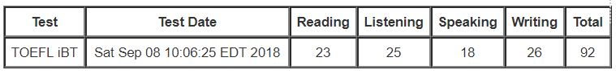
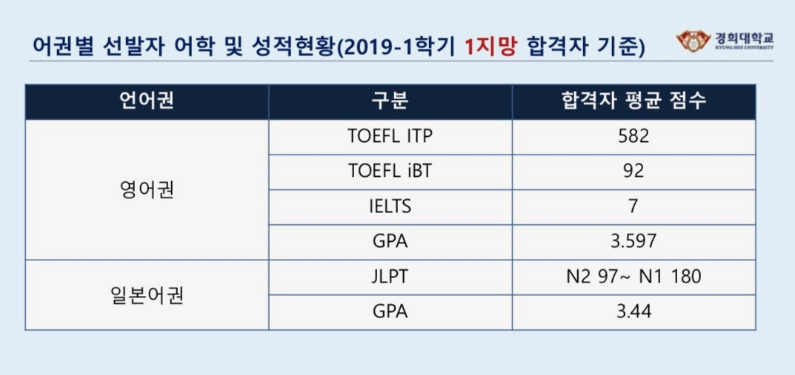

## 🤮 토플은 토 나와서 토플인가?

작년 초 두 달 동안 종로해커스로 토플학원을 다녔다. 수능 과목 중 영어를 제일 못 봤지만 그래도 수능 감이 남아있지는 않을까 싶어서 바로 레벨테스트를 봤는데, 프리해커스 반이 나왔다. 아마 종로해커스에는 프리해커스 반이 없었던 걸로 기억한다. 당시는 회기동에 살고 있을 때라 매일 강남역까지 가기는 무리였고, 종로에서 85+ 중급반 강의를 수강했다.

그 흔한 토익, 텝스 같은 공인 어학 시험 성적 하나 없었는데 첫 토플 치고 목표했던 90점을 넘어서 행복했다. 리딩도 생각보다 낮고, 스피킹도 많이 부족함을 느꼈다. 나름 스피킹은 잘 한다고 생각했는데 토플 공부하면서 스피킹 자신감이 오히려 잔뜩 떨어지긴 했다. 그래도 경희대학교 기준으로 보통 80점이 최소 요구 기준이었고, 어차피 졸업 즈음에 100점대를 목표로 공부해야 할 것 같아서 첫 시험 성적으로 제출하기로 했다.

## 😢 교환학생 설명회와 뼈 때리는 팩트

친구 Y는 서울캠퍼스로, 저는 국제캠퍼스로 교환학생 설명회를 다녀왔다. 조금 일찍 학교에 도착해서 서브웨이를 먹고 설명회를 갔는데, 방학이라 그런지 버스가 잘 다니질 않더라구요. 설명회는 같은 부서(국제교류처)에서 진행하는 설명회니까 내용도 똑같을 줄 알았는데 많이 달랐다. 혹시나 교환학생 설명회에 참석할 생각이 있다면 시간을 내서라도 국제캠퍼스 설명회를 가는 게 좋을 것 같다.

지원자들이 가장 궁금해할 정보인 1지망 합격자 기준 토플과 GPA 평균. 물론 뽑는 인원수가 많지 않아서 소신지원하는 게 가장 맞다. 나는 토플은 딱 합격자 평균과 똑같았고, GPA는 조금 더 높았다. [^1]

[^1]: 글을 수정하는 시점에 합격자 발표가 나왔다. 나는 지원교 최소 어학성적에 딱 맞는 어학점수를 가지고 있어서 어학점수 베네핏은 받지 못했는데 1지망 합격이 된 걸 보면 역시 소신지원이 답이다.

## 🤔 서류 준비와 자기성찰

고3 수시 원서 접수 시기가 떠올랐다. 그 당시 썼던 자기소개서 대학에 들어와서 다시 읽을 수가 없더라. 자기소개서는 홍보계획을 포함해 수학언어(나는 영어권이니 영어로)로 작성해야 했다. 제대로 작성해 본 자기소개서는 (물론 중간중간 장학금 자기소개서도 있었지만) 거의 3~4년 전이라 기억이 가물가물했다. 그래도 되돌아 보니 자기소개서를 작성하면서 내가 왜 교환학생을 가고 싶어하는지, 가서 무엇을 할 것인지 나름의 생각 정리를 할 수 있었던 계기였다. 고맙게도 예전 교환학생 멘토였던 L이 첨삭을 도와줬다.

<iframe width="560" height="315" src="https://www.youtube.com/embed/3Y3zebxuvrI" frameborder="0" allow="accelerometer; autoplay; encrypted-media; gyroscope; picture-in-picture" allowfullscreen></iframe>

서류를 작성하면서 영감이 되어주었던 노래는 (우주 최강 락밴드) [페퍼톤스](http://www.peppertones.net/)의 4집 수록곡 '행운을 빌어요' 다. 4집의 이름이 'Beginner's luck', 우리말로 하면 '초심자의 행운'인데, 이 단어를 제 자기소개서의 주요 테마로 적었다. 고등학교 선행학습 대신 미국으로의 교환학생을 떠난 이야기, 파리에서 날아온 편지 한 통을 믿고 처음 만나는 펜팔 친구의 한국 가이드가 되었던 이야기(정말 스펙타클했음) 등등 초심자의 행운을 믿었기 때문에 찾아온 순간들을 담았다.

## 🔥 홍보 계획과 또 시작된 일 벌리기

[^1]

[^1]: http://blogs.lut.fi/studying-at-lut/badges-and-overalls/

한국의 '과잠' 문화처럼 핀란드와 스웨덴을 비롯한 북유럽 국가에는 'overall' 문화가 있다고 한다. 한국의 과잠에는 보통 (대부분 흑역사가 되는) 학번을 박고, 단과대학이나 학과를 상징하는 문구와 자신의 이니셜 정도를 추가하는 정도의 커스텀이 일반적인 것 같은데 이곳의 overall은 정말 커스텀의 끝판왕이라는 생각이 들었다. 멋지게 말하면 점프수트, 투박하게 말하면 작업복처럼 생긴 이 overall에 패치를 붙이는 게 이곳의 문화라고 한다. '내가 이런 파티에 참여했어!', '내가 이런 이벤트에 참여했어!' 정도를 나타내기 위해 파티를 비롯한 주요 행사에서는 이런 패치를 나눠준다고 한다.

어깨 너머 포토샵을 배운 지 10년, 덕질 10년차 (..) 이제 웬만한 굿즈는 만들 수 있다. 아직 일러스트레이터는 부족한 수준이지만, 펜툴 잘 쓰면 일러 잘 쓰는 거라고 하자. 그래서 이번 교환학생에는 직접 제작한 경희대 자수 패치를 가져가 친구들에게 나눠주려고 합니다. 100개 정도 발주해서 가고 싶고, 조금 더 욕심을 내자면 이 프로젝트로 교내 장학금에 도전하거나 다같이 공동구매를 하고 싶다. 아이패드로 구상한 다음 노트북으로 옮겨와 일러로 세부적인 디자인을 해볼 생각이다. 
