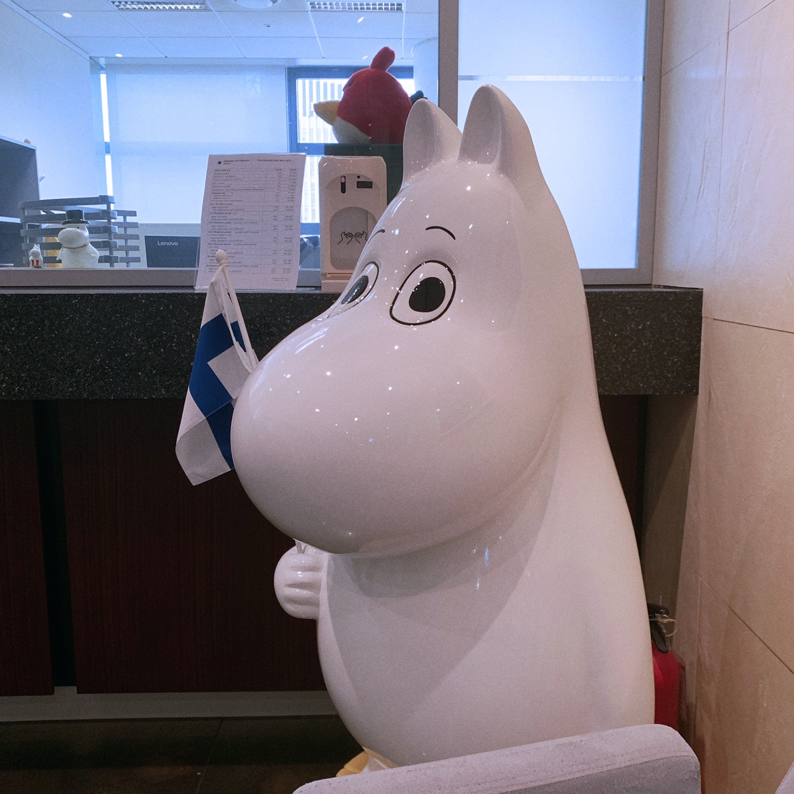

## 🙃 일단은 붙었다! 교환학생!

'저 교환학생 가요' 라고 동네방네 실컷 떠들어댔는데, 사실 마음 한켠엔 불안감이 있었다. 사실은 교환학생에 합격한 게 아니라 더 정확히 말하면 교환학생 '후보자'에 합격한 상태였어서 (극히 이례적인 경우지만) 파견교 교환학생에 떨어질 수도 있었기 때문이다. 파견교에 서류를 보내고, 파견교에서 다시 나에게 입학허가서를 보내줘야 진짜로 교환학생 신분이 된다. 해야 할 일은 대략

* solenovo에서 학생 등록하기
* learning agreement 작성하기

정도였는데, 유독 내 입학허가서만 시간이 지나도 오질 않았다. 다시 말하지만 입학 허가서가 도착해야 교환학생 '후보자'에서 교환학생이 되는 거라서, 기숙사도 항공권도 심지어 비자(거주허가증)도 입학 허가서가 나와야 신청할 수 있었다. 본전공인 사회학이 아니라 수학으로 교환학생을 신청해서 그런가, 지난 학기에 망쳐버린 미분적분학과 선형대수 성적이 걸림돌이 된 건가 며칠을 고민했다. 그런데 알고 보니 learning agreement에 작성한 과목들 중 단 한 과목도(!) 가을 학기에 열리지 않는 과목이었고, 그래서 늦어졌다고 한다.

<iframe src="https://www.linkedin.com/embed/feed/update/urn:li:ugcPost:6534078390603956224" height="627" width="504" frameborder="0" allowfullscreen="" title="삽입된 업데이트"></iframe>

우여곡절 끝에 결국 입학 허가서를 받았고, 드디어 교환학생 신분으로 인정받았다. 이때까지만 해도 입학허가서를 받는 게 가장 어려울 줄 알았다. 뒤로 이어질 수많은 고난은 상상도 못하고(...)

## 🇫🇮 핀란드 대사관 거주허가증 인터뷰

<iframe src="https://www.google.com/maps/embed?pb=!1m18!1m12!1m3!1d3162.332140546246!2d126.97567151472072!3d37.57079587979711!2m3!1f0!2f0!3f0!3m2!1i1024!2i768!4f13.1!3m3!1m2!1s0x357cbd273168acdf%3A0xcd69f08fed2a29fb!2z7KO87ZWcIO2VgOuegOuTnCDrjIDsgqzqtIA!5e0!3m2!1sko!2skr!4v1561129810350!5m2!1sko!2skr" width="600" height="450" frameborder="0" style="border:0" allowfullscreen></iframe>

[e-service](https://finlandabroad.fi/web/kor/frontpage)로 학생 거주허가증 신청을 한 다음, 9시부터 12시 사이에 광화문 교보빌딩에 있는 주한 핀란드 대사관을 찾아가면 된다. (대사관 근처 <u>코닥문화칼라</u>에서 핀란드 규격 비자사진을 찍을 수 있다) e-service 잘못 작성한 건 아닌지 혹시 비자 안 나오면 어쩌나 잔뜩 걱정했는데 큰 무리 없이 비자를 발급받을 수 있다. 

신청을 마치고 보름 정도 뒤에 'Residence permit arrived' 라는 메일이 도착하면 같은 업무 시간 안에 대사관을 찾으면 된다. 수령은 신청보다 훨씬 간단하다. 

거주허가증 수령은 1분 안에 끝났던 것 같은데, 쉥겐 조약 이것저것 여쭤보느랴 5분정도 걸렸다. '대사관이 주는 딱딱한 분위기 + 내 뒤에 사람들 기다림 + 초면인 담당자' 이 셋의 시너지 덕에 초등학생도 안 쓸 듯한 영어로 이것저것 여쭤봤다. 