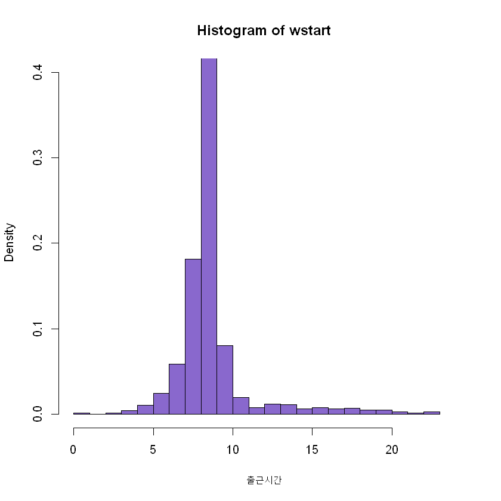
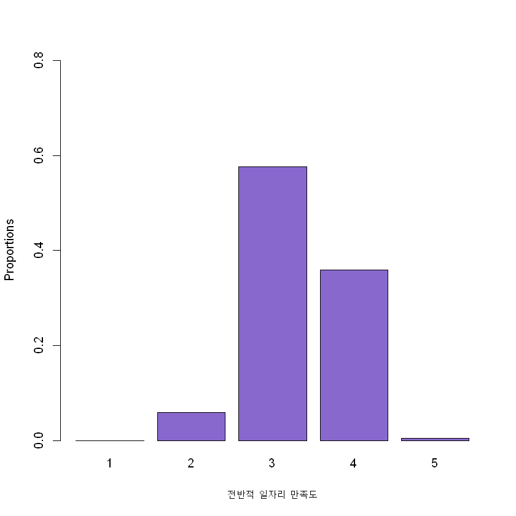
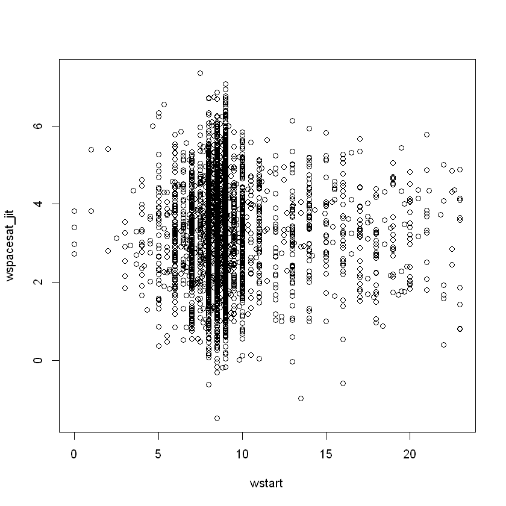
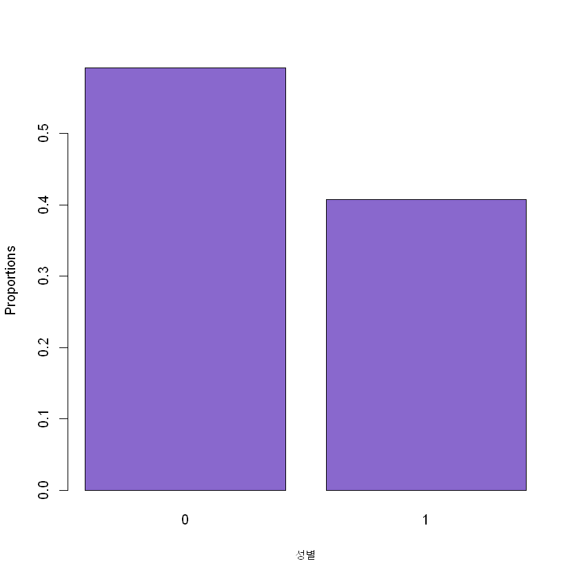
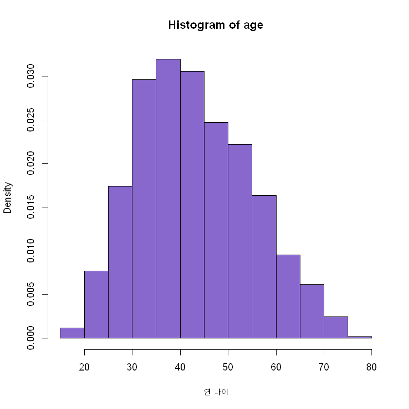
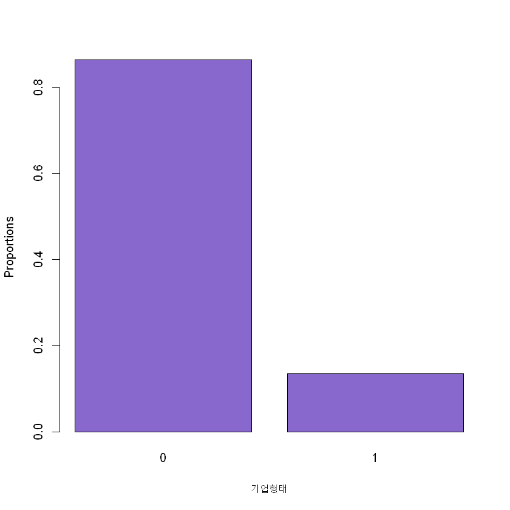
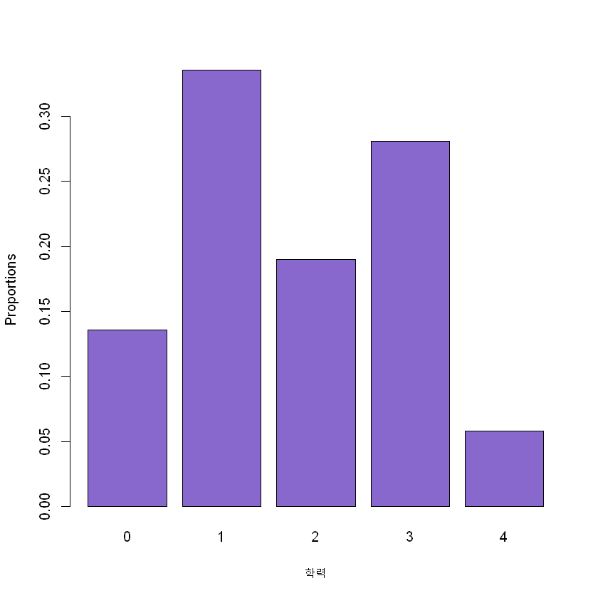
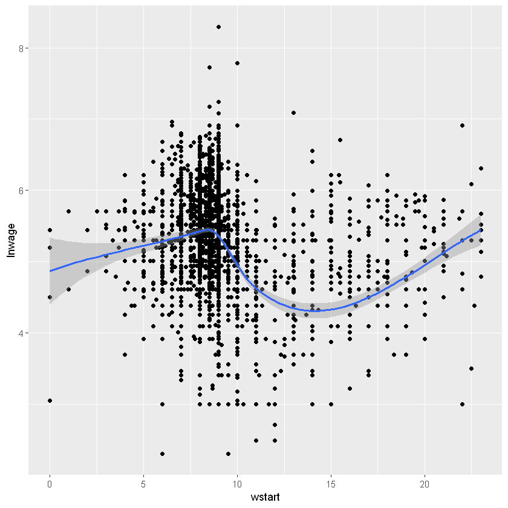
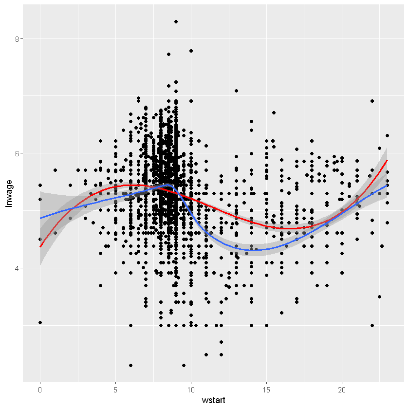

## 💭 출근 시간이 늦어질수록 전반적 일자리 만족도가 증가할까?

### 작업공간 불러오기 및 기본 설정


```R
load("C:/Users/eunee/khu_sda_project/data_cleaning.RData")
```

시각화를 위해 ```ggplot2``` 패키지를 설치한다.


```R
install.packages("ggplot2")
library("ggplot2")
```

    Warning message:
    "unable to access index for repository http://www.stats.ox.ac.uk/pub/RWin/bin/windows/contrib/3.5:
      URL 'http://www.stats.ox.ac.uk/pub/RWin/bin/windows/contrib/3.5/PACKAGES'를 열 수 없습니다"
    
    package 'ggplot2' successfully unpacked and MD5 sums checked
    
    The downloaded binary packages are in
    	C:\Users\eunee\AppData\Local\Temp\RtmpCc81vx\downloaded_packages


```R
attach(nrdt_attach)
```

### 기초 통계

사용할 자료들의 기초 통계는 다음과 같다.


```R
summary(nrdt_attach)
```


          pid               wstart         wspacesat         wtime         gend    
     Min.   :     102   Min.   : 0.000   Min.   :1.000   Min.   : 0.3333   0:2901  
     1st Qu.:  193278   1st Qu.: 8.000   1st Qu.:3.000   1st Qu.: 9.0000   1:1999  
     Median :  353304   Median : 9.000   Median :3.000   Median : 9.0000           
     Mean   : 1870533   Mean   : 9.046   Mean   :3.309   Mean   : 9.5761           
     3rd Qu.:  596777   3rd Qu.: 9.000   3rd Qu.:4.000   3rd Qu.:10.0000           
     Max.   :11014502   Max.   :23.000   Max.   :5.000   Max.   :24.0000           
          age       comp_type educ     jobty        lnwage     
     Min.   :18.0   0:4236    0: 666   0:3669   Min.   :2.304  
     1st Qu.:35.0   1: 664    1:1644   1: 813   1st Qu.:4.942  
     Median :42.0             2: 931   2: 418   Median :5.298  
     Mean   :43.6             3:1375            Mean   :5.296  
     3rd Qu.:52.0             4: 284            3rd Qu.:5.704  
     Max.   :80.0                               Max.   :8.294  


설명변수와 종속변수의 분포를 그래프로 나타내 보자. 


```R
hist(wstart, freq = F, ylab="Density", xlab="출근시간", col="mediumpurple3", xlim = c(0,24), ylim = c(0, 0.4), breaks = 24)
```





오전 7시~9시에 출근하는 사람이 가장 많다.


```R
barplot(prop.table(table(wspacesat)), ylim=c(0, 0.8), col="mediumpurple3",
        xlab="전반적 일자리 만족도", ylab="Proportions")
```





전반적 일자리 만족도는 보통과 만족에 분포가 집중되어 있다.

### 난수를 넣은 설명변수와 종속변수의 분포

설명변수인 출근시간은 양적 변수이고, 종속변수인 일자리 만족도는 범주형 변수이기 때문에 두 변수로 단순히 산포도를 그리기 어렵다. 따라서 <u>난수를 더해 종속 변수를 연속형 변수로 생각한 다음</u> 분포를 그려볼 수 있다.


```R
detach(nrdt_attach)
```


```R
set.seed(38365)
nrdt_attach$wspacesat_jit <- nrdt_attach$wspacesat+rnorm(length(nrdt_attach$wspacesat))
```


```R
attach(nrdt_attach)
```


```R
fit3 <- lm(wspacesat ~ factor(wtime) + factor(gend) + age + factor(educ) + wtime + lnwage + factor(jobty) + factor(comp_type))
plot(wstart, wspacesat_jit)
```





단순히 설명변수와 종속변수의 관계를 보면 뚜렷한 연관성은 보이지 않는다.

### 통제변수의 분포


```R
barplot(prop.table(table(gend)), col="mediumpurple3",
        xlab="성별", ylab="Proportions")
```





```R
hist(age, freq = F, ylab="Density", xlab="연 나이", col="mediumpurple3")
```





```R
barplot(prop.table(table(comp_type)), col="mediumpurple3",
        xlab="기업형태", ylab="Proportions")
```





```R
barplot(prop.table(table(educ)), col="mediumpurple3",
        xlab="학력", ylab="Proportions")
```





### 선형회귀분석
설명 변수는 양적 변수이고, 종속 변수는 5점 척도의 양적 변수로 취급하였다. 따라서 두 변수 간 선형관계를 파악하기 위해 최소제곱법을 이용한 선형회귀분석을 시행하였다.


```R
summary(lm(wspacesat ~ wstart))
```


​    
​    Call:
​    lm(formula = wspacesat ~ wstart)
​    
    Residuals:
        Min      1Q  Median      3Q     Max 
    -2.3099 -0.3094 -0.3088  0.6906  1.7000 
    
    Coefficients:
                 Estimate Std. Error t value Pr(>|t|)    
    (Intercept)  3.318767   0.032783 101.235   <2e-16 ***
    wstart      -0.001104   0.003503  -0.315    0.753    
    ---
    Signif. codes:  0 '***' 0.001 '**' 0.01 '*' 0.05 '.' 0.1 ' ' 1
    
    Residual standard error: 0.5877 on 4898 degrees of freedom
    Multiple R-squared:  2.03e-05,	Adjusted R-squared:  -0.0001839 
    F-statistic: 0.09941 on 1 and 4898 DF,  p-value: 0.7526


설명변수의 계수는 0에 수렴하고, p값은 통상적 유의수준보다 크므로 유의미한 선형관계가 있다고 볼 수 없다.

### 다중선형회귀분석
혼동변수를 통제한 상태로 다중선형회귀분석을 시행해 본다. 통제한 변수는 로그임금, 성별, 종사상 지위, 기업 형태, 학력 변수이다.


```R
summary(lm(wspacesat ~ wstart + lnwage + factor(gend) + factor(jobty) + factor(comp_type) + factor(educ)))
```


​    
​    Call:
​    lm(formula = wspacesat ~ wstart + lnwage + factor(gend) + factor(jobty) + 
​        factor(comp_type) + factor(educ))
​    
    Residuals:
        Min      1Q  Median      3Q     Max 
    -2.2752 -0.3242 -0.1526  0.4982  2.2081 
    
    Coefficients:
                        Estimate Std. Error t value Pr(>|t|)    
    (Intercept)         2.014878   0.096709  20.834  < 2e-16 ***
    wstart              0.004964   0.003307   1.501  0.13337    
    lnwage              0.215147   0.016428  13.096  < 2e-16 ***
    factor(gend)1       0.152437   0.017769   8.579  < 2e-16 ***
    factor(jobty)1     -0.064778   0.023582  -2.747  0.00604 ** 
    factor(jobty)2     -0.261753   0.030848  -8.485  < 2e-16 ***
    factor(comp_type)1  0.267660   0.023202  11.536  < 2e-16 ***
    factor(educ)1      -0.009827   0.025862  -0.380  0.70399    
    factor(educ)2       0.041012   0.029699   1.381  0.16736    
    factor(educ)3       0.088049   0.028683   3.070  0.00215 ** 
    factor(educ)4       0.255861   0.041908   6.105 1.11e-09 ***
    ---
    Signif. codes:  0 '***' 0.001 '**' 0.01 '*' 0.05 '.' 0.1 ' ' 1
    
    Residual standard error: 0.5404 on 4884 degrees of freedom
    Multiple R-squared:  0.1541,	Adjusted R-squared:  0.1523 
    F-statistic: 88.96 on 10 and 4884 DF,  p-value: < 2.2e-16


설명변수의 계수는 혼동변수를 통제하기 전보다 커졌지만, 여전히 유의미하다고 보기는 어렵다.

### 이차 다항식 선형 회귀
일차 선형관계로 설명변수와 종속변수를 분석하는 것은 적절하지 않아 보인다. 다른 선형 모형이 관계를 보여줄 수도 있지 않을까? 이차 다항식 선형 회귀 모형을 설명변수와 종속변수에 적용해 보자.


```R
summary(lm(wspacesat ~ poly(wstart,2)))
```


​    
​    Call:
​    lm(formula = wspacesat ~ poly(wstart, 2))
​    
    Residuals:
        Min      1Q  Median      3Q     Max 
    -2.3541 -0.3253 -0.3036  0.6747  1.8128 
    
    Coefficients:
                      Estimate Std. Error t value Pr(>|t|)    
    (Intercept)       3.308776   0.008377 394.977  < 2e-16 ***
    poly(wstart, 2)1 -0.185299   0.586399  -0.316    0.752    
    poly(wstart, 2)2 -2.808725   0.586399  -4.790 1.72e-06 ***
    ---
    Signif. codes:  0 '***' 0.001 '**' 0.01 '*' 0.05 '.' 0.1 ' ' 1
    
    Residual standard error: 0.5864 on 4897 degrees of freedom
    Multiple R-squared:  0.004683,	Adjusted R-squared:  0.004277 
    F-statistic: 11.52 on 2 and 4897 DF,  p-value: 1.019e-05


이차항 설명변수의 계수가 약 -2.8로 나타나며 p값도 통상적 유의 수준보다 작게 나타난다. 이제 혼동변수를 통제한 상태에서 이차 다항식 선형 회귀모형을 나타내 보자.


```R
summary(lm(wspacesat ~ poly(wstart, 2) + factor(gend) + factor(jobty) + factor(comp_type) + educ))
```


​    
​    Call:
​    lm(formula = wspacesat ~ poly(wstart, 2) + factor(gend) + factor(jobty) + 
​        factor(comp_type) + educ)
​    
    Residuals:
        Min      1Q  Median      3Q     Max 
    -2.2985 -0.3304 -0.1697  0.5561  2.1100 
    
    Coefficients:
                       Estimate Std. Error t value Pr(>|t|)    
    (Intercept)         3.19690    0.02613 122.360  < 2e-16 ***
    poly(wstart, 2)1    0.12840    0.56147   0.229 0.819121    
    poly(wstart, 2)2   -0.99357    0.56493  -1.759 0.078682 .  
    factor(gend)1       0.05521    0.01690   3.267 0.001096 ** 
    factor(jobty)1     -0.17529    0.02244  -7.810 6.94e-15 ***
    factor(jobty)2     -0.36789    0.03029 -12.145  < 2e-16 ***
    factor(comp_type)1  0.27193    0.02360  11.521  < 2e-16 ***
    educ1               0.04477    0.02598   1.723 0.084957 .  
    educ2               0.11516    0.02971   3.877 0.000107 ***
    educ3               0.18601    0.02823   6.590 4.87e-11 ***
    educ4               0.41188    0.04095  10.058  < 2e-16 ***
    ---
    Signif. codes:  0 '***' 0.001 '**' 0.01 '*' 0.05 '.' 0.1 ' ' 1
    
    Residual standard error: 0.5499 on 4889 degrees of freedom
    Multiple R-squared:  0.1262,	Adjusted R-squared:  0.1244 
    F-statistic: 70.59 on 10 and 4889 DF,  p-value: < 2.2e-16


```R
summary(lm(wspacesat ~ poly(wstart, 2) + lnwage + factor(gend) + factor(jobty) + factor(comp_type) + educ))
```


​    
​    Call:
​    lm(formula = wspacesat ~ poly(wstart, 2) + lnwage + factor(gend) + 
​        factor(jobty) + factor(comp_type) + educ)
​    
    Residuals:
        Min      1Q  Median      3Q     Max 
    -2.2692 -0.3236 -0.1471  0.4981  2.2009 
    
    Coefficients:
                       Estimate Std. Error t value Pr(>|t|)    
    (Intercept)         2.05703    0.08987  22.888  < 2e-16 ***
    poly(wstart, 2)1    0.83720    0.55432   1.510  0.13103    
    poly(wstart, 2)2   -1.28872    0.55558  -2.320  0.02040 *  
    lnwage              0.21745    0.01643  13.235  < 2e-16 ***
    factor(gend)1       0.14625    0.01798   8.135 5.16e-16 ***
    factor(jobty)1     -0.06496    0.02358  -2.755  0.00589 ** 
    factor(jobty)2     -0.26224    0.03082  -8.509  < 2e-16 ***
    factor(comp_type)1  0.26700    0.02320  11.510  < 2e-16 ***
    educ1              -0.01553    0.02594  -0.599  0.54944    
    educ2               0.03316    0.02984   1.111  0.26653    
    educ3               0.07840    0.02890   2.712  0.00671 ** 
    educ4               0.24806    0.04210   5.892 4.07e-09 ***
    ---
    Signif. codes:  0 '***' 0.001 '**' 0.01 '*' 0.05 '.' 0.1 ' ' 1
    
    Residual standard error: 0.5404 on 4888 degrees of freedom
    Multiple R-squared:  0.1564,	Adjusted R-squared:  0.1545 
    F-statistic: 82.38 on 11 and 4888 DF,  p-value: < 2.2e-16


(다른 변수들을 통제한 후 결과를 비교해 보니) 로그임금을 통제했을 때 이차항 계수의 절댓값이 크고, p값은 더욱 작아진다. 두 모형에 분산분석을 적용해 비교해 보면


```R
fit3 <- lm(wspacesat ~ poly(wstart,2) +  factor(gend) + age +
             factor(jobty)+factor(comp_type) + factor(educ))

fit4 <- lm(wspacesat ~ poly(wstart,2) + lnwage + factor(gend) + age +
             factor(jobty)+factor(comp_type) + factor(educ))


anova(fit3, fit4)
```


<table>
<thead><tr><th scope=col>Res.Df</th><th scope=col>RSS</th><th scope=col>Df</th><th scope=col>Sum of Sq</th><th scope=col>F</th><th scope=col>Pr(&gt;F)</th></tr></thead>
<tbody>
	<tr><td>4888       </td><td>1477.470   </td><td>NA         </td><td>      NA   </td><td>      NA   </td><td>         NA</td></tr>
	<tr><td>4887       </td><td>1426.719   </td><td> 1         </td><td>50.75066   </td><td>173.8383   </td><td>4.94703e-39</td></tr>
</tbody>
</table>


로그임금 변수를 포함한 모형의 F검정 값이 매우 크며 p값 역시 매우 작다. 따라서 설명변수와 종속변수는 위로 볼록한 이차함수의 모형을 따른다.    
    
즉, <u>출근시간이 늦어질수록 전반적 일자리 만족도가 증가하다가 특정 변곡점 이후로는 오히려 감소</u>한다.

### 로그임금 변수의 특성 분석
로그임금 변수는 왜 특히 통제했을 때의 영향력이 강할까? 


```R
ggplot(nrdt_attach, aes(wstart, lnwage))+ geom_point() + geom_smooth(method = "loess")
```





출근시간과 로그임금의 산점도에 LOESS 곡선을 그린 것인데, 그래프 상으로 오전 10시경에 변곡점을 가지는 3차함수의 그래프와 모양이 유사하다.


```R
ggplot(nrdt_attach, aes(wstart, lnwage))+ geom_point() +geom_smooth(method = "lm", formula = y ~ poly(x,3), color = "red")+ geom_smooth(method = "loess")
```





실제로 3차 회귀곡선을 빨간색 그래프로 추가해 보면 유사한 개형을 가지고 있다. 3차 다항식을 적용해 출근시간 변수와 로그임금 변수의 관계를 알아보자.


```R
summary(lm(lnwage ~ poly(wstart, 3)))
```


​    
​    Call:
​    lm(formula = lnwage ~ poly(wstart, 3))
​    
    Residuals:
         Min       1Q   Median       3Q      Max 
    -3.14123 -0.34377 -0.00508  0.40037  2.99061 
    
    Coefficients:
                     Estimate Std. Error t value Pr(>|t|)    
    (Intercept)       5.29579    0.00881 601.117  < 2e-16 ***
    poly(wstart, 3)1 -7.39646    0.61669 -11.994  < 2e-16 ***
    poly(wstart, 3)2  1.91414    0.61669   3.104  0.00192 ** 
    poly(wstart, 3)3  7.39814    0.61669  11.996  < 2e-16 ***
    ---
    Signif. codes:  0 '***' 0.001 '**' 0.01 '*' 0.05 '.' 0.1 ' ' 1
    
    Residual standard error: 0.6167 on 4896 degrees of freedom
    Multiple R-squared:  0.05726,	Adjusted R-squared:  0.05669 
    F-statistic: 99.13 on 3 and 4896 DF,  p-value: < 2.2e-16


실제로 3차항의 계수는 -7.4에 가까우며 p값도 통상적 유의수준보다 작다. 따라서 출근시간과 로그임금 변수의 관계는 유의미하며, 구체적으로는 3차항의 관계를 가진다. 로그임금 변수는 설명변수와 종속변수 모두와 유의미한 관계를 갖기 때문에 통제했을 때의 영향력이 더욱 강하다.

## 👍 결론
설명변수와 종속변수는 다음과 같은 관계를 갖는다.   
$$wspacesat\quad =\quad 2.05703\quad +\quad 0.83720wstart\quad -\quad 1.28872{ wstart }^{ 2 }+0.21475lnwage\quad +\quad ..$$  
이 함수에서 미분계수가 0이 되는 지점 이후에는 출근시간이 늦어질수록 일자리 만족도가 하락한다.   
실제 미분계수가 0이 되는 지점은 약 전체 24시간 중 0.3(오전 12시 20분 경)이므로, 출근시간이 늦어질수록 전반적 일자리 만족도가 하락한다고 결과를 일반화할 수 있겠다.

## 🤔 후기
처음으로 직접 문제 설정부터 자료 수집, 분석, 시각화, 보고서 작성까지 끝낸 프로젝트다. 심지어 첫 프로젝트가 팀 프로젝트!

1. n차 다항식 회귀를 처음 적용해 보았다. 단순 선형회귀 모형(+다중 선형 회귀)만 사용해 보았는데 어쩌다 보니 처음 보는 회귀모형을 적용해 볼 수 있었다. 교수님께서 자료를 분석하기 전에 꼭 **산점도**를 그려보라고 하셨는데, 산점도를 그리지 않았더라면 이런 관계도 보지 못했을 것이다.   
   
2. 그런데 n차 다항식 회귀를 적용하는 게 마감일 직전에(...) 우연히 시도해 본 것이라 코드와 n차 다항식 회귀에 대한 개념적 이해가 정말 미숙했다.
   
3. 처음으로 **jupyter notebook**과 **github**를 이용해 프로젝트를 해 보았다. 협업을 할 때 R 파일만 주고받으니 효율성과 PC간 호환성이 좋지 않았는데, 프로젝트의 허브 역할을 하는 github 저장소를 만들어 놓고 관리하니 의사소통이 한결 편해졌다. 다만 pull request 하고 서로의 코드를 리뷰하는 수준까지는 가지 못했다. 그리고 뒤늦게 r studio도 마크다운을 지원한다는 걸 알았다. 
   
4. 코드를 깔끔하게 정리하고 분석 흐름을 글로 보기좋게 적는 연습을 해야겠다.
